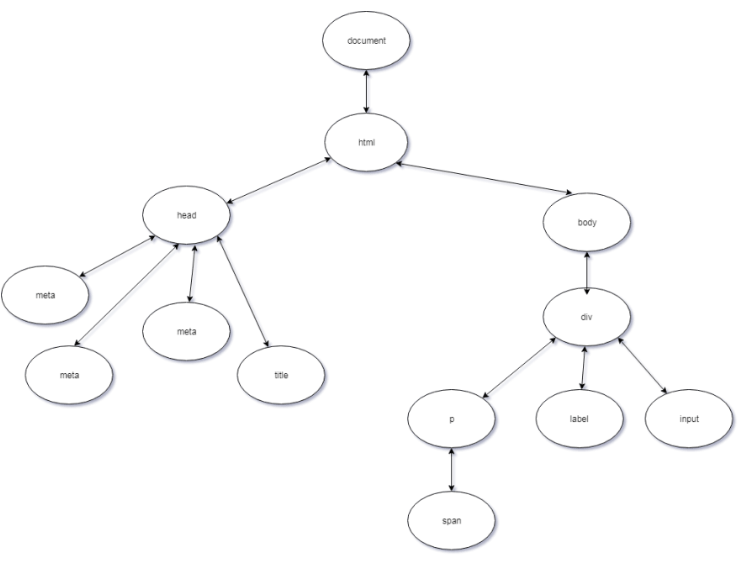

# JavaScript
## Типы данных
>1. number
>2. string
>3. BigInt
>4. null - для неизвестнных данных
>5. undefined - для неприсвоенных значений
>6. boolean
>7. object - ассоциативный массив
>8. symbol


## Что нового привнес в JS стандарт ES6 или ECMAScript2015?
>1. Стрелочные функции
>2. Классы
>3. Промисы
>4. Symbol
>5. rest, spread
>6. let, const
>7. Деструктуризация
>8. Шаблонные строки ('\n')
## В чем разница между значениями `null` и `undefined`?

В JavaScript `null` и `undefined` представляют отсутствие значения, но у них есть небольшие различия в их семантике и использовании.

### `undefined`:

- `undefined` означает, что переменная объявлена, но ей не было присвоено никакое значение.

### `null`:

- `null` означает, что переменная объявлена, но явно имеет пустое значение.

### Примеры:

```javascript
let variable1; // Значение переменной будет undefined
const variable2 = null; // Значение переменной будет null

console.log(variable1); // Вывод: undefined
console.log(variable2); // Вывод: null

console.log(variable1 === undefined); // Вывод: true
console.log(variable2 === null); // Вывод: true
```

### Когда использовать каждое значение?

- `undefined` используется, когда переменная существует, но ей не было присвоено значение. Это может быть результатом объявления переменной без инициализации, а также результатом отсутствия возвращаемого значения в функции.

- `null` используется, когда вы явно хотите указать, что переменная имеет пустое или отсутствующее значение. Это может быть полезным, например, при сбросе значения переменной на "ничто".

Обратите внимание, что при сравнении с помощью оператора `===`, `null` и `undefined` равны друг другу, но не равны никаким другим значениям:

```javascript
console.log(null === undefined); // Вывод: true
console.log(null == undefined); // Вывод: true

console.log(null === 0); // Вывод: false
console.log(undefined === 0); // Вывод: false
```

В общем, использование `null` и `undefined` зависит от контекста и задачи, но оба значения представляют отсутствие или пустое значение.

## Строки
### Методы строк
>1. indexOf()
>2. includes()
>3. slice()
>4. substring(start, end) - трока между start и end
>5. substr(start, length) - cтрока со start, длинной lenght
>6. trim() - убирает пробелы
## Объекты
>Объекты присваиваются и сравниваются по ссылке
### Способы создания объекта
1. Литеральная нотация:
```javascript
var obj = {}; // пустой объект
var person = {
  name: "John",
  age: 30,
  location: "New York"
};
```
2. Функция-конструктор:
```javascript
function Person(name, age, location) {
  this.name = name;
  this.age = age;
  this.location = location;
}

var john = new Person("John", 30, "New York");
```
3. Object.create():
```javascript
var personProto = {
  sayHello: function() {
    console.log("Hello!");
  }
};

var john = Object.create(personProto);
john.name = "John";
john.age = 30;
john.location = "New York";
```
4. Class (введена в ECMAScript 2015):
```javascript
class Person {
  constructor(name, age, location) {
    this.name = name;
    this.age = age;
    this.location = location;
  }
}

var john = new Person("John", 30, "New York");
```
### В чем разница между оператором «in» и методом hasOwnProperty?
Отличие состоит в том, что оператор «in» проверяет наличие свойства не только в самом объекте, но и в его прототипах, а метод hasOwnProperty — только в объекте.
```javascript
console.log('prop' in o) // true
console.log('toString' in o) // true

console.log(o.hasOwnProperty('prop')) // true
console.log(o.hasOwnProperty('toString')) // false
```
### Сравнение двух объектов
>1. JSON.stringify()
>2. Написать свою функцию, которая будет проходить через каждое св-во и сравнивать со свойством другого объекта. Пример:
```javascript
function isDeepEqual(obj1, obj2) {
    var keys1 = Object.keys(obj1);
    var keys2 = Object.keys(obj2);
 
    if (keys1.length != keys2.length) {
        return false;
    }
 
    for (var key of keys1) {
        if (!keys2.includes(key) || !isDeepEqual(obj1[key], obj2[key])) {
            return false;
        }
    }
 
    return true;
    }
```
### Методы объектов
>1. Object.keys() - создает массив ключей объекта.
>2. Object.values() - создает массив значений объекта.
>3. Object.entries() - создает вложенный массив пар «ключ-значение» объекта.
>4. Object.assign() - копирует значения из одного объекта в другой. Создает из двух объектов один.
>5. Object.freeze() - предотвращает модификацию свойств и значений объекта и добавление или удаление свойств объекта.
>6. Object.seal() - предотвращает добавление новых свойств объекта, но позволяет изменять существующие свойства.
>7. Object.getPrototypeOf() - используется для получения внутреннего скрытого [[Prototype]] объекта, также доступного через свойство __proto__.


## Что такое прототип объекта?
В двух словах, прототип — это план (схема или проект) объекта. Он используется как запасной вариант для свойств и методов, существующих в данном объекте. Это также один из способов обмена свойствами и функциональностью между объектами. Это основная концепция прототипного наследования в JS.
```javascript
const o = {}
console.log(o.toString()) // [object Object]
```
Несмотря на то, что объект «о» не имеет свойства toString, обращение к этому свойству не вызывает ошибки. Если определенного свойства нет в объекте, его поиск осуществляется сначала в прототипе объекта, затем в прототипе прототипа объекта и так до тех пор, пока свойство не будет найдено. Это называется цепочкой прототипов. На вершине цепочки прототипов находится Object.prototype.
```javascript
console.log(o.toString === Object.prototype.toString) // true
```
### Разница между `call`, `apply` и `bind`

В JavaScript, методы `call`, `apply` и `bind` используются для установки контекста выполнения функции и передачи аргументов.

Метод `call` вызывает функцию с заданным контекстом и передает аргументы в виде отдельных значений. Синтаксис: `function.call(context, arg1, arg2, ...)`.

Метод `apply` также вызывает функцию с заданным контекстом, но передает аргументы в виде массива. Синтаксис: `function.apply(context, [arg1, arg2, ...])`.

Метод `bind` создает новую функцию, привязывая ее к определенному контексту выполнения и, при необходимости, предоставляя некоторые аргументы. Этот метод не вызывает функцию немедленно, а возвращает новую функцию, которую можно вызвать позже. Синтаксис: `function.bind(context, arg1, arg2, ...)`. Вызов новой функции `bind` с переданными аргументами вызовет исходную функцию с указанным контекстом.

Основное отличие между `call`, `apply` и `bind` заключается в способе передачи аргументов. `call` передает аргументы в виде отдельных значений, `apply` передает аргументы в виде массива, а `bind` создает новую функцию с предустановленными аргументами.

## Что такое __proto__ и prototype
__proto__ и prototype - это всё свойства объекта. Любой объект в javaScript имеет свойство __proto__ Но свойство prototype имеют только функции конструкторы или классы.

Каждое свойство __proto__ ссылается на prototype класса с помощью которого был создан объект. Например мы создаем строку и __proto__ этой строки будет ссылаться на функцию с помощью которой она была создана. Строки появляются с помощью new String()

## Геттеры и сеттеры

Геттеры и сеттеры — это специальные методы класса, которые позволяют получать и устанавливать значения свойств объекта. Они используются для контроля доступа к свойствам объекта, проверки входных данных и выполнения дополнительной логики.

Геттер – для чтения и сеттер – для записи.

```javascript
const obj = {
  get propName() {
    // геттер, срабатывает при чтении obj.propName
  },

  set propName(value) {
    // сеттер, срабатывает при записи obj.propName = value
  }
};
```

Геттер срабатывает, когда obj.propName читается, сеттер – когда значение присваивается.

Геттеры и сеттеры вызываются как свойства объектов, а не как функции.

- get – функция без аргументов, которая сработает при чтении свойства,
- set – функция, принимающая один аргумент, вызываемая при присвоении свойства,

```javascript
const user = {
  name: "John",
  surname: "Smith",

  get fullName() {
    return `${this.name} ${this.surname}`;
  },

  set fullName(value) {
    [this.name, this.surname] = value.split(" ");
  }
};

// set fullName запустится с данным значением
user.fullName = "Alice Cooper";

alert(user.name); // Alice
alert(user.surname); // Cooper
```

## Какое значение имеет this?
Обычно this ссылается на значение объекта, который в данный момент выполняет или вызывает функцию. «В данный момент» означает, что значение this меняется в зависимости от контекста выполнения, от того места, где мы используем this.

```javascript
const carDetails = {
    name: 'Ford Mustang',
    yearBought: 2005,
    getName() {
        return this.name
    }
    isRegistered: true
}

console.log(carDetails.getName()) // Ford Mustang
```

В данном случае метод getName возвращает this.name, а this ссылается на carDetails, объект, в котором выполняется getName, который является ее «владельцем».

Добавим после console.log три строчки:
```javascript
var name = 'Ford Ranger'
var getCarName = carDetails.getName

console.log(getCarName()) // Ford Ranger
```

Второй console.log выдает Ford Ranger, и это странно. Причина такого поведения заключается в том, что «владельцем» getCarName является объект window. Переменные, объявленные с помощью ключевого слова «var» в глобальной области видимости, записываются в свойства объекта window. this в глобальной области видимости ссылается на объект window (если речь не идет о строгом режиме).
```javascript
console.log(getCarName === window.getCarName) // true
console.log(getCarName === this.getCarName) // true
```
В этом примере this и window ссылаются на один объект.

Одним из способов решения данной проблемы является использование методов call или apply:

```javascript
console.log(getCarName.apply(carDetails)) // Ford Mustang
console.log(getCarName.call(carDetails)) // Ford Mustang
```

Call и apply принимают в качестве первого аргумента объект, который будет являться значением this внутри функции.

В IIFE, функциях, которые создаются в глобальном области видимости, анонимных функциях и внутренних функциях методов объекта значением this по умолчанию является объект window.
```javascript
(function() {
	console.log(this)
})() // window

function iHateThis() {
	console.log(this)
}
iHateThis() // window

const myFavouriteObj = {
	guessThis() {
		function getName() {
			console.log(this.name)
		}
		getName()
	},
	name: 'Marko Polo',
	thisIsAnnoying(callback) {
		callback()
	}
}

myFavouriteObj.guessThis() // window
myFavouriteObj.thisIsAnnoying(function() {
	console.log(this) // window
})
```
Существует два способа получить «Marko Polo».

Во-первых, мы можем сохранить значение this в переменной:
```javascript
const myFavoriteObj = {
    guessThis() {
        const self = this // сохраняем значение this в переменной self
        function getName() {
            console.log(self.name)
        }
        getName()
    },
    name: 'Marko Polo',
    thisIsAnnoying(callback) {
        callback()
    }
}
```

Во-вторых, мы можем использовать стрелочную функцию:
```javascript
const myFavoriteObj = {
    guessThis() {
        const getName = () => {
            // копируем значение this из внешнего окружения
            console.log(this.name)
        }
        getName()
    },
    name: 'Marko Polo',
    thisIsAnnoying(callback) {
        callback()
    }
}
```

Стрелочные функции не имеют собственного значения this. Они копируют значение this из внешнего лексического окружения.
## Массивы
### Перебор массива
>1. for(let i = 0; i < arr.length; i++)
>2. for(let item of arr)
>3. while()
### Методы массивов
#### Методы для добавления и извлечения элементов
>1. unshift() - добавляет элементы в начало массива
>2. push() - добавляет элементы в конец массива
>3. shift() - извлекает элементы из начала массива
>4. pop() - извлекает элементы из конца массива
>5. splice() - добавляет, удаляет или заменяет элементы из любой части массива
#### Методы для формирования новых массивов на основе существующих
>1. slice() - копирует элементы одного массива
>2. concat() - копирует элементы нескольких массивов
>3. filter() - возвращает массив по условию
>4. map() - возвращает массив на основе исходного
#### Методы для проверок и итераций по массиву
>1. forEach() - перебирает массив и ничего не возвращает
>2. every() - проверяет, соответствуют ли все элементы массива заданному условию
>3. some() - проверяет, выполняется ли условие хотя бы для одного элемента массива
#### Методы для поиска элементов и индексов в массиве
>1. indexOf() - возвращает индекс искомого элемента
>2. lastIndexOf() - возвращает индекс искомого элемента, но начинает поиск с конца массива
>3. includes() - проверяет наличие элемента в массиве
>4. find() - возвращает первый элемент в массиве, который удовлетворяет условию поиска
#### Методы для преобразования массивов
>1. sort() - возвращает отсортированный массив
>2. reverse() - разворачивает массив, меняет порядок элементов
>3. reduce() - свёртывает элементы массива в единое значение

### Дополнительно
>1. Array.isArray() - проверяет, является ли переданное значение массивом
>2. Array.from() - создает массив на основе объекта/строки
>3. flatMap() - позволяет сформировать массив, применяя функцию к каждому элементу, затем уменьшает вложенность, делая этот массив плоским, и возвращает его.
``` javascript
    const orders = [
    {
        id: 1,
        products: [
            { name: 'Чизкейк', price: 1.99 },
            { name: 'Бисквит', price: 4.99 },
        ]
    },
    {
        id: 2,
        products: [
            { name: 'Шоколад', price: 5.59 },
            { name: 'Зефир', price: 8.99 },
        ]
    }
]
```
```javascript
orders.flatMap(
  (order) => order.products.map(product => product.name)
)
```
```javascript
['Чизкейк', 'Бисквит', 'Шоколад', 'Зефир']
```
>3. Rest - запаковывает все элементы в массив
>4. Spred - распаковывает инерируемый объект


## Map, Set

- Map - Map - это вид объекта JavaScript, но в отличии от обычных объектов, ключи в Map могут быть любым типом данных, а не только строками или символами.

- Set - это коллекция уникальных значений без индексов и ключей. Для простоты понимания можно представить что Set это Map, которых хранит только значения, а не пары ключ-значение

### Сравнение Map и Object
Объекты (Objects) и карты (Maps) являются структурами данных в JavaScript и используются для хранения пар ключ-значение. Однако у них есть некоторые различия в функциональности и использовании.

Объекты в JavaScript являются коллекциями свойств, где каждое свойство имеет имя (ключ) и соответствующее значение. Ключи в объектах являются строками или символами. Объекты поддерживают доступ к значениям по ключу, добавление и удаление свойств, итерацию по свойствам и прочие операции. Однако у объектов также есть прототипы и методы, которые позволяют наследовать и расширять свойства и функциональность объектов.

Map, с другой стороны, является коллекцией, где значения хранятся в виде пар ключ-значение. Ключи в Map могут быть любого типа данных, включая объекты и функции. Map поддерживает операции добавления, удаления и обновления пар ключ-значение, а также получение значения по ключу. Он также предоставляет методы для итерации по парам ключ-значение и общую информацию о размере коллекции.

Основная разница между объектами и картами заключается в том, что объекты лучше подходят для создания и управления свойствами с определенной структурой, тогда как карты обеспечивают более гибкую структуру данных и позволяют использовать любой тип данных в качестве ключа. Кроме того, карты имеют лучшую производительность в случаях, когда требуется частое добавление и удаление пар ключ-значение.

## WeakMap, WeakSet

WeakSet – особый вид Set, не препятствующий сборщику мусора удалять свои элементы. То же самое – WeakMap для Map.

#### Отличия WeakMap от Map:
1. Ключи могут быть только объектами. Примитивные типы (числа, строки, булевы значения) не могут быть ключами.
2. Если объект, используемый в качестве ключа, больше не используется в других местах, он может быть удалён сборщиком мусора, что предотвращает утечки памяти
3. Имеет методы set, get, delete и has, однако нет методов для итерации по элементам, так как WeakMap не поддерживает перечисление элементов.
4. Очень полезен для хранения метаданных и вспомогательной информации, когда важно избегать утечек памяти.

#### Отличия WeakSet от Set:
1. Однако может содержать только объекты в качестве элементов.
2.  Если объект, добавленный в WeakSet, больше не используется в других местах, он будет удалён сборщиком мусора. Это предотвращает утечки памяти.
3. Имеет методы add, delete и has, но нет методов для итерации, так как WeakSet не поддерживает перечисление.
4. Полезен для случаев хранения уникальных объектов, когда необходимо управлять памятью.


## Сборка мусора
Управление памятью в JavaScript выполняется автоматически и незаметно. Мы создаём примитивы, объекты, функции… Всё это занимает память.

#### Достижимость
Основной концепцией управления памятью в JavaScript является принцип достижимости.

Если упростить, то «достижимые» значения – это те, которые доступны или используются. Они гарантированно находятся в памяти.

1. Существует базовое множество достижимых значений, которые не могут быть удалены.

Например:

- Выполняемая в данный момент функция, её локальные переменные и параметры.
- Другие функции в текущей цепочке вложенных вызовов, их локальные переменные и параметры.
- Глобальные переменные.

Эти значения мы будем называть корнями.

2. Любое другое значение считается достижимым, если оно доступно из корня по ссылке или по цепочке ссылок.

Например, если в глобальной переменной есть объект, и он имеет свойство, в котором хранится ссылка на другой объект, то этот объект считается достижимым. И те, на которые он ссылается, тоже достижимы. Далее вы познакомитесь с подробными примерами на эту тему.

В движке JavaScript есть фоновый процесс, который называется сборщиком мусора. Он отслеживает все объекты и удаляет те, которые стали недоступными.
## Что такое область видимости (scope) в JavaScript?

Область видимости (scope) в JavaScript определяет, где и какие переменные и функции будут видимы и доступны в определенной части кода. Область видимости контролирует, какие имена переменных можно использовать в данной части программы и какие не мешают друг другу.

## Что такое хойстинг (hoisting) в JavaScript?

Хостинг (hoisting) в JavaScript - это поведение, при котором объявления переменных и функций перемещаются в начало своей области видимости во время компиляции (до выполнения кода). Это может привести к тому, что вы можете обращаться к переменным или функциям до их фактического объявления.

### Пример хойстинга переменных:

```javascript
console.log(message); // undefined, но не будет ошибки
var message = "Привет, хойстинг!";
console.log(message); // "Привет, хостинг!"
```

Первый вызов `console.log()` покажет `undefined`, потому что переменная `message` уже поднята (hoisted) в начало области видимости, но ей еще не присвоено значение. Второй вызов покажет фактическое значение переменной.

### Пример хойстинга функций:

```javascript
greet(); // "Привет, хойстинг функций!"

function greet() {
  console.log("Привет, хойстинг функций!");
}
```

В этом примере функция `greet()` также поднимается в начало области видимости, поэтому её можно вызвать до фактического объявления.

Хойстинг может быть запутанным и привести к неожиданным результатам, поэтому рекомендуется всегда объявлять переменные и функции перед их использованием.

## Var, let, const
>1. var - для скуфов. Глобальная область видимости, значение переменной можно изменить. Переменная var объявляется в самом начале скрипта, но значение записывается только тогда, когда доходит код до той строки, где значение присваивается.
>2. const - константное значние, блочная область видимости.
>3. let - значение переменной можно изменить, блочная область видимости.

## Функции
>1. Function Declaration - функция, объявленная в основном потоке кода.
>2. Function Expression - объявление функции в контексте какого-либо выражения, например присваивания.
```javascript
// Function Declaration
    function sum(a, b) {
        return a + b;
    }
    
// Function Expression
    var sum = function(a, b) {
      return a + b;
    }
```
Оновное отличие между ними: функции, объявленные как Function Declaration, создаются интерпретатором до выполнения кода.

### Лямбда функции и стрелочные функции

Лямбда-функции или стрелочные функции в JavaScript представляют собой сокращенный синтаксис для создания функций. Они были добавлены в стандарт ECMAScript 6 (ES6) и позволяют определить функции более компактно и кратко.

Синтаксис лямбда-функции выглядит следующим образом:

(parameter1, parameter2, ..., parameterN) => {
// код функции
}

Этот синтаксис позволяет передавать параметры функции в скобках и описывать тело функции после стрелки (=>). Если тело функции состоит из единственного выражения, то оно может быть написано без фигурных скобок. В этом случае значение этого выражения автоматически станет возвращаемым значением функции.

Примеры использования лямбда-функций:

// Обычная функция
function multiply(a, b) {
return a \* b;
}

// Лямбда-функция
const multiply = (a, b) => a \* b;

// Вызов функции
console.log(multiply(2, 3)); // Выведет 6

Лямбда-функции очень удобны в тех случаях, когда требуется использовать функции как аргументы в других функциях (например, методы массивов, такие как map, filter, reduce и т.д.), либо для определения кратких, однострочных функций.

## Функции первого порядка

функция, которая может быть присвоена переменной, передана как аргумент в другую функцию или возвращена как результат другой функции. Такие функции могут быть использованы как любые другие значения в языке программирования.

Вот пример первоклассной функции в JavaScript:

```javascript
function sayHello(name) {
  console.log("Привет, " + name + "!");
}

var greeting = sayHello; // присвоение функции переменной
greeting("Максим"); // вызов функции через переменную
```

В данном примере функция `sayHello` присваивается переменной `greeting` и далее вызывается через эту переменную. Это один из примеров использования первоклассных функций в JavaScript.

## Что такое функция высшего порядка в JavaScript?

Функция высшего порядка (higher order function) в JavaScript - это функция, которая принимает другую функцию в качестве аргумента или возвращает функцию в качестве результата. Это особое свойство языка, которое позволяет работать с функциями как с данными и использовать их в различных сценариях.

Пример функции высшего порядка в JavaScript:

```javascript
function multiplyBy(factor) {
  return function (number) {
    return number * factor;
  };
}

var multiplyByTwo = multiplyBy(2);
var multiplyByThree = multiplyBy(3);

console.log(multiplyByTwo(4)); // Вывод: 8
console.log(multiplyByThree(4)); // Вывод: 12
```

В этом примере функция `multiplyBy` принимает фактор и возвращает анонимную функцию, которая умножает число на данный фактор. Затем функции `multiplyByTwo` и `multiplyByThree` используются для умножения чисел на 2 и 3 соответственно.

Функции высшего порядка являются мощным инструментом в JavaScript и могут быть использованы для создания более гибкого и абстрактного кода.

## Унарная функция
Унарная функция (unary function) в JavaScript - это функция, которая принимает только один аргумент. Она обрабатывает этот аргумент и возвращает результат. Вот пример унарной функции на русском языке:

```javascript
// Унарная функция, преобразующая число в его квадрат
function квадрат(число) {
  return число * число;
}

// Вызов унарной функции
let число = 5;
let квадратЧисла = квадрат(число);
console.log(квадратЧисла); // Выведет 25
```

## Что такое каррирование в JavaScript?

Каррирование (currying) - это техника функционального программирования, которая позволяет превратить функцию с несколькими аргументами в последовательность функций, каждая из которых принимает только один аргумент.

Вот пример каррированной функции на русском языке, которая складывает два числа:

```javascript
// Каррированная функция, складывающая два числа
function сложить(a) {
  return function (b) {
    return a + b;
  };
}

// Вызов каррированной функции
let результат = сложить(2)(3);
console.log(результат); // Выведет 5
```

В этом примере `сложить(2)` возвращает функцию, которая принимает один аргумент `b` и возвращает сумму `a + b`. Затем `сложить(2)(3)` принимает второй аргумент `3` и возвращает результат сложения `2 + 3`.

## Что такое чистая функция в JavaScript?

Чистая функция (pure function) - это функция, которая всегда возвращает одинаковый результат при одинаковых входных данных и не имеет побочных эффектов. Она не изменяет состояние программы или какие-либо внешние переменные.

Вот пример чистой функции на русском языке, которая складывает два числа:

```javascript
// Чистая функция, складывающая два числа
function сложить(a, b) {
  return a + b;
}

// Вызов чистой функции
let результат = сложить(2, 3);
console.log(результат); // Выведет 5
```

В этом примере функция `сложить` всегда возвращает одинаковый результат для одних и тех же входных данных `a` и `b`, и она не влияет на состояние программы или внешние переменные.

## Что такое IIFE (Immediately Invoked Function Expression) в JavaScript?

IIFE (Immediately Invoked Function Expression) в JavaScript - это паттерн, при котором функция определяется и немедленно вызывается (выполняется) в том же месте, где она была объявлена. Этот подход позволяет создать локальную область видимости для изолирования переменных и кода, исключая возможные конфликты имён с другими частями программы.

Пример:

```javascript
(function () {
  var message = "Привет из IIFE!";
  console.log(message);
})(); // Функция вызывается сразу после объявления

// Нельзя обратиться к переменной message вне IIFE, так как она находится в её области видимости
console.log(message); // Это вызовет ошибку
```

Здесь анонимная функция определена внутри круглых скобок `(function() {...})` и сразу же вызывается, заключив `()` в конце. Это создает свою область видимости, в которой можно безопасно определять переменные, не затрагивая глобальное пространство имён.

## Что такое мемоизация (memoization) в JavaScript?

Мемоизация (memoization) в JavaScript - это оптимизационная техника, которая заключается в сохранении результатов выполнения дорогостоящих функций, чтобы избежать повторных вычислений при одних и тех же входных данных. Суть мемоизации заключается в кешировании результатов функции на основе аргументов, что позволяет сократить время выполнения, особенно для функций с большими вычислительными затратами.

### Пример мемоизации:

```javascript
function expensiveCalculation(n) {
  console.log("Вычисление для", n);
  return n * 2;
}

function memoizedCalculation() {
  let cache = {}; // Кеш для результатов

  return function (n) {
    if (n in cache) {
      console.log("Используется кеш для", n);
      return cache[n];
    } else {
      cache[n] = expensiveCalculation(n);
      return cache[n];
    }
  };
}

const memoized = memoizedCalculation();

console.log(memoized(5)); // Первый вызов, вычисление для 5
console.log(memoized(5)); // Используется кеш для 5
console.log(memoized(8)); // Первый вызов, вычисление для 8
console.log(memoized(8)); // Используется кеш для 8
```

В этом примере `memoizedCalculation()` возвращает функцию, которая использует кеш для хранения результатов `expensiveCalculation()`. При первом вызове функции с определенным аргументом результат вычисления сохраняется в кеше, а при последующих вызовах для того же аргумента результат берется из кеша, что сэкономит время и вычислительные ресурсы.

## Что такое замыкания (closures) в JavaScript?

Замыкания (closures) в JavaScript - это феномен, при котором функция сохраняет доступ к переменным из внешней области видимости, даже после завершения выполнения этой функции. Это позволяет функции "запомнить" значения переменных, существующих в том контексте, в котором она была создана.

### Пример замыкания:

```javascript
function createCounter() {
  let count = 0;

  return function () {
    count++;
    return count;
  };
}

const counter = createCounter();

console.log(counter()); // 1
console.log(counter()); // 2
console.log(counter()); // 3
```

В этом примере `createCounter()` возвращает функцию, которая имеет доступ к переменной `count`, хотя `createCounter()` уже выполнена. Это происходит из-за замыкания: функция "запоминает" контекст, в котором она была создана, и сохраняет доступ к переменным этого контекста.

Замыкания часто используются для создания частных переменных и данных, скрытых от глобальной области видимости, и для создания функций обратного вызова.

## Что такое функция обратного вызова (callback function)?

Функция обратного вызова (callback function) в JavaScript - это функция, которая передается в качестве аргумента другой функции и вызывается после завершения определенной операции или события. Она позволяет создавать асинхронный код и контролировать его поток выполнения.

### Пример функции обратного вызова:

```javascript
// Пример асинхронной функции с функцией обратного вызова
function fetchData(callback) {
  setTimeout(() => {
    const data = "Данные получены";
    callback(data);
  }, 2000);
}

// Использование функции обратного вызова
fetchData((result) => {
  console.log(result); // "Данные получены"
});
```

В этом примере функция `fetchData` выполняет асинхронную операцию и после ее завершения вызывает переданную функцию обратного вызова. Таким образом, мы можем определить, что делать с данными после их получения.

Функции обратного вызова используются часто для обработки асинхронных операций, обработки событий, запросов к серверу и других сценариев, где результат операции может быть неизвестен на момент вызова функции. Однако, использование большого количества вложенных коллбэков может привести к "callback hell" - сложному для читаемости и поддержки коду.

## Что такое async/await?
Async/await —  способ написания асинхронного (неблокирующего) кода в JS. Им оборачивают промис. Он делает код более читаемым и чистым, чем промисы и функции обратного вызова. Однако для использования async/await необходимо хорошо знать промисы.

```javascript
// промис
function callApi(){
	return fetch('url/to/api/endpoint')
        .then(resp => resp.json())
        .then(data => {
            // работаем с данными
        }).catch(err => {
            // работаем с ошибкой
        })
}

// async/await
// для перехвата ошибок используется try/catch
async function callApi(){
	try{
            const resp = await fetch('url/to/api/endpoint')
            const data = await res.json()
		// работаем с данными
	} catch(e){
		// работаем с ошибкой
	}
}
```
Использование ключевого слова «async» перед функцией заставляет ее возвращать промис.

Ключевое слово «await» можно использовать только внутри асинхронной функции. Использование «await» внутри другой функции приведет к ошибке. Await ожидает завершения выражения справа, чтобы вернуть его значение перед выполнением следующей строчки кода.
```javascript
const giveMeOne = async() => 1

function getOne(){
    try{
        const num = await giveMeOne()
        console.log(num)
    } catch(e){
        console.log(e)
    }
}
// Uncaught SyntaxError: await is only valid in an async function

async function getTwo(){
    try{
        const num1 = await giveMeOne()
        const nm2 = await giveMeOne()
        return num1 + num2
    } catch(e){
        console.log(e)
    }
}

await getTwo() // 2
```
## Что такое промис (Promise)?

Промис (Promise) - это объект в JavaScript, представляющий результат успешного завершения или ошибки асинхронной операции. Он позволяет более удобно и читаемо обрабатывать асинхронный код, делая его более структурированным и предсказуемым.

### Пример промиса:

```javascript
// Пример асинхронной функции, которая возвращает промис
function fetchData() {
  return new Promise((resolve, reject) => {
    setTimeout(() => {
      const data = "Данные получены";
      resolve(data); // Успешное завершение
      // Если произошла ошибка: reject(new Error("Ошибка получения данных"));
    }, 2000);
  });
}

// Использование промиса
fetchData()
  .then((result) => {
    console.log(result); // "Данные получены"
  })
  .catch((error) => {
    console.error(error);
  });
```

В этом примере функция `fetchData` возвращает промис, который успешно завершается через 2 секунды. Мы используем метод `.then` для обработки успешного выполнения промиса и метод `.catch` для обработки ошибки.

Промисы позволяют создавать цепочки асинхронных операций, улучшая читаемость и управляемость кода. Они также предоставляют механизмы для обработки нескольких асинхронных операций сразу, например, с помощью `Promise.all` или `Promise.race`.

## Зачем нужен промис (Promise)?

Промис (Promise) в JavaScript используется для более удобной и структурированной обработки асинхронного кода. Асинхронные операции, такие как запросы к серверу, чтение/запись в файлы или таймеры, могут занять некоторое время и могут быть завершены в будущем. Промисы помогают справиться с такими ситуациями и улучшить читаемость кода.

### Пример использования промиса:

```javascript
// Пример асинхронной функции с промисом
function fetchData() {
  return new Promise((resolve, reject) => {
    setTimeout(() => {
      const data = "Данные получены";
      resolve(data); // Успешное завершение
    }, 2000);
  });
}

// Использование промиса
fetchData()
  .then((result) => {
    console.log(result); // "Данные получены"
  })
  .catch((error) => {
    console.error(error);
  });
```

**Почему промисы полезны:**

1. **Обработка асинхронности**: Промисы предоставляют четкий способ обрабатывать асинхронные операции, позволяя избежать "callback hell" - глубоко вложенных коллбэков.

2. **Читаемость кода**: Код с использованием промисов более структурирован и легко читается, так как асинхронные операции описываются последовательно с помощью методов `.then` и `.catch`.

3. **Управление ошибками**: Промисы предоставляют механизм для обработки ошибок с помощью метода `.catch`, что делает код более надежным и предсказуемым.

4. **Цепочки операций**: Промисы позволяют создавать цепочки операций, где результат одной операции используется как вход для следующей.

5. **Параллельные операции**: Промисы также позволяют выполнять несколько асинхронных операций параллельно и ждать, пока все они завершатся.

Промисы стали стандартной практикой для обработки асинхронного кода и являются фундаментальным элементом при работе с современными веб-приложениями.

## Каковы три состояния промиса (Promise)?

Промис (Promise) в JavaScript имеет три основных состояния, которые описывают текущее состояние выполнения асинхронной операции.

1. **Ожидание (Pending)**: Начальное состояние, когда промис создан, но операция, связанная с ним, еще не завершена. Промис находится в ожидании результата.

2. **Выполнено (Fulfilled)**: Состояние, в котором асинхронная операция успешно завершена. Промис переходит в это состояние, когда вызывается функция `resolve()`, передавая ей результат операции.

3. **Отклонено (Rejected)**: Состояние, в котором асинхронная операция завершается с ошибкой. Промис переходит в это состояние, когда вызывается функция `reject()`, передавая ей информацию об ошибке.

## В чем разница между явным и неявным преобразованием или приведением к типу (Implicit and Explicit Coercion)?

Неявное преобразование — это способ приведения значения к другому типу без нашего ведома

```javascript
console.log(1 + '6')
console.log(false + true)
console.log(6 * '2')
```

Явное преобразование предполагает наше участие в приведении значения к другому типу:

```javascript
console.log(1 + parseInt('6'))
```

## Что такое классы?
Классы — это относительно новый способ написания функций-конструкторов в JS. Это синтаксический сахар для функций-конструкторов. В основе классов лежат те же прототипы и прототипное наследование:
```javascript
// ES5
function Person(firstName, lastName, age, address){
    this.firstName = firstName
    this.lastName = lastName
    this.age = age
    this.address = address
}

Person.self = function(){
    return this
}

Person.prototype.toString = function(){
    return '[object Person]'
}

Person.prototype.getFullName = function(){
    return this.firstName + ' ' + this.lastName
}

// ES6
class Person{
    constructor(firstName, lastName, age, address){
        this.firstName = firstName
        this.lastName = lastName
        this.age = age
        this.address = address
    }

    static self(){
        return this
    }

    toString(){
        return '[object Person]'
    }

    getFullName(){
        return `${this.firstName} ${this.lastName}`
    }
}
```

Переопределение методов и наследование от другого класса:
```javascript
// ES5
Employee.prototype = Object.create(Person.prototype)

function Employee(firstName, lastName, age, address, jobTitle, yearStarted){
    Person.call(this, firstName, lastName, age, address)
    this.jobTitle = jobTitle
    this.yearStarted = yearStarted
}

Employee.prototype.describe = function(){
    return `I am ${this.getFullName()} and I have a position of #{this.jobTitle} and I started at ${this.yearStarted}}`
}

Employee.prototype.toString = function(){
    return '[object Employee]'
}

// ES6
class Employee extends Person{ // наследуемся от Person
    constructor(firstName, lastName, age, address, jobTitle, yearStarted){
        super(firstName, lastName, age, address)
        this.jobTitle = jobTitle
        this.yearStarted = yearStarted
    }

    describe(){
       return `I am ${this.getFullName()} and I have a position of #{this.jobTitle} and I started at ${this.yearStarted}}` 
    }

    toString(){ // переопределяем метод toString класса Person
        return '[object Employee]'
    }
}
```

## Для чего используется ключевое слово «new»?

Ключевое слово «new» используется в функциях-конструкторах для создания нового объекта (нового экземпляра класса).

```javascript
function Employee(name, position, yearHired){
    this.name = name
    this.position = position
    this.yearHired = yearHired
}

const emp = new Employee('Marko Polo', 'Software Development', 2017)
```

Ключевое слово «new» делает 4 вещи:
>1. Создает пустой объект.
>2. Привязывает к нему значение this.
>3. Функция наследует от functionName.prototype.
>4. Возвращает значение this, если не указано иное.

## Что такое запоминание или мемоизация (Memoization)?
Мемоизация — это прием создания функции, способной запоминать ранее вычисленные результаты или значения. Преимущество мемоизации заключается в том, что мы избегаем повторного выполнения функции с одинаковыми аргументами. Недостатком является то, что мы вынуждены выделять дополнительную память для сохранения результатов.

## Как реализовать вспомогательную функцию запоминания?

```javascript
function memoize(fn){
    const cache = {}
    return function(param){
        if(cache[param]){
            console.log('cached')
            return cache[param]
        } else{
            let result = fn(param)
            cache[param] = result
            console.log('not cached')
            return result
        }
    }
}

const toUpper = (str = '') => str.toUpperCase()

const toUpperMemoized = memoize(toUpper)

toUpperMemoized('abcdef')
toUpperMemoized('abcdef') // не выполнится
```

## Что такое DOM?

DOM или Document Object Model (объектная модель документа) — это прикладной программный интерфейс (API) для работы с HTML и XML документами. Когда браузер первый раз читает («парсит») HTML документ, он формирует большой объект, действительно большой объект, основанный на документе — DOM. DOM представляет собой древовидную структуру (дерево документа). DOM используется для взаимодействия и изменения самой структуры DOM или его отдельных элементов и узлов.
```html
<!DOCTYPE html>
<html lang="en">

<head>
    <meta charset="UTF-8">
    <meta name="viewport" content="width=device-width">
    <meta http-equiv="X-UA-Compatible" content="ie=edge">
    <title>Document Object Model</title>
</head>

<body>
    <div>
        <p>
            <span></span>
        </p>
        <label></label>
        <input>
    </div>
</body>

</html>
```

DOM этого HTML выглядит так:



## Что такое распространение события (Event Propagation)?

Когда какое-либо событие происходит в элементе DOM, оно на самом деле происходит не только в нем. Событие «распространяется» от объекта Window до вызвавшего его элемента (event.target). При этом событие последовательно пронизывает (затрагивает) всех предков целевого элемента. Распространение события имеет три стадии или фазы:
Фаза погружения (захвата, перехвата) — событие возникает в объекте Window и опускается до цели события через всех ее предков.
Целевая фаза — это когда событие достигает целевого элемента.
Фаза всплытия — событие поднимается от event.target, последовательно проходит через всех его предков и достигает объекта Window.


## Что такое всплытие события?

Когда событие происходит в элементе DOM, оно затрагивает не только этот элемент. Событие «всплывает» (подобно пузырьку воздуха в воде), переходит от элемента, вызвавшего событие (event.target), к его родителю, затем поднимается еще выше, к родителю родителя элемента, пока не достигает объекта Window.

Допустим, у нас есть такая разметка:
```html
<div class="grandparent">
    <div class="parent">
        <div class="child">1</div>
    </div>
</div>
```

И такой JS:
```javascript
function addEvent(el, event, callback, isCapture = false) {
    if (!el || !event || !callback || typeof callback !== 'function') return

    if (typeof el === 'string') {
        el = document.querySelector(el)
    }
    el.addEventListener(event, callback, isCapture)
}

addEvent(document, 'DOMContentLoaded', () => {
    const child = document.querySelector('.child')
    const parent = document.querySelector('.parent')
    const grandparent = document.querySelector('.grandparent')

    addEvent(child, 'click', function(e) {
        console.log('child')
    })

    addEvent(parent, 'click', function(e) {
        console.log('parent')
    })

    addEvent(grandparent, 'click', function(e) {
        console.log('grandparent')
    })

    addEvent('html', 'click', function(e) {
        console.log('html')
    })

    addEvent(document, 'click', function(e) {
        console.log('document')
    })

    addEvent(window, 'click', function(e) {
        console.log('window')
    })
})
```

У метода addEventListener есть третий необязательный параметр — useCapture. Когда его значение равняется false (по умолчанию), событие начинается с фазы всплытия. Когда его значение равняется true, событие начинается с фазы погружения (для «прослушивателей» событий, прикрепленных к цели события, событие находится в целевой фазе, а не в фазах погружения или всплытия. События в целевой фазе инициируют все прослушиватели на элементе в том порядке, в котором они были зарегистрированы независимо от параметра useCapture — прим. пер.). Если мы кликнем по элементу child, в консоль будет выведено: child, parent, grandparent, html, document, window. Вот что такое всплытие события.

##  Что такое погружение события?

Когда событие происходит в элементе DOM, оно происходит не только в нем. В фазе погружения событие опускается от объекта Window до цели события через всех его предков.

JS Код из прошлого примера

У метода addEventListener есть третий необязательный параметр — useCapture. Когда его значение равняется false (по умолчанию), событие начинается с фазы всплытия. Когда его значение равняется true, событие начинается с фазы погружения. Если мы кликнем по элементу child, то увидим в консоли следующее: window, document, html, grandparent, parent, child. Это и есть погружение события.

## В чем разница между методами event.preventDefault() и event.stopPropagation()?

Метод event.preventDefault() отключает поведение элемента по умолчанию. Если использовать этот метод в элементе form, то он предотвратит отправку формы (submit). Если использовать его в contextmenu, то контекстное меню будет отключено (данный метод часто используется в keydown для переопределения клавиатуры, например, при создании музыкального/видео плеера или текстового редактора — прим. пер.). Метод event.stopPropagation() отключает распространение события (его всплытие или погружение).


## Как узнать об использовании метода event.preventDefault()?

Для этого мы можем использовать свойство event.defaultPrevented, возвращающее логическое значение, служащее индикатором применения к элементу метода event.preventDefault.

##  Что такое цель события или целевой элемент (event.target)?

Простыми словами, event.target — это элемент, в котором происходит событие, или элемент, вызвавший событие.


Имеем такую разметку:

```html
<div onclick="clickFunc(event)">
    <div>
        <div>
            <button>
                Button
            </button>
        </div>
    </div>
</div>
```

И такой простенький JS:

```javascript
function clickFunc(event) {
    console.log(event.target)
}
```

Мы прикрепили «слушатель» к внешнему div. Однако если мы нажмем на кнопку, то получим в консоли разметку этой кнопки. Это позволяет сделать вывод, что элементом, вызвавшим событие, является именно кнопка, а не внешний или внутренние div.

## Что такое текущая цель события (event.currentTarget)?

- Event.currentTarget — это элемент, к которому прикреплен прослушиватель событий.

Мы прикрепили слушатель к внешнему div. Куда бы мы ни кликнули, будь то кнопка или один из внутренних div, в консоли мы всегда получим разметку внешнего div. Это позволяет заключить, что event.currentTarget — это элемент, к которому прикреплен прослушиватель событий.
