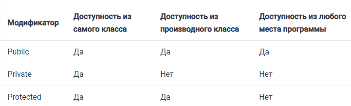

## Что такое ООП?

Объектно-ориентированное программирование или ООП – это методология программирования, которая представляет программное обеспечение в виде набора объектов. Каждый объект – это не что иное, как экземпляр класса.

##  Каковы основные концепции ООП?

- Наследование
- Инкапсуляция
- Полиморфизм
- Абстракция

**Наследование** - Если вы порождаете класс от другого класса, это называется наследованием.
Дочерний класс наследует все публичные и защищенные свойства и методы от родительского класса. Дочерний класс также может иметь свои собственные свойства и методы. Наследуемый класс определяется с помощью ключевого слова extends.

**Инкапсуляция** - является частью концепции ООП. Она относится к объединению данных с методами, которые работают с этими данными. Это также помогает ограничить любой прямой доступ к некоторым компонентам объекта.
Инкапсуляция позволяет скрыть данные и обернуть данные и код, который работает над ними, в единое целое.

**Полиморфизм** - концепция, согласно которой различные классы могут использоваться с одним и тем же интерфейсом. Каждый из этих классов может иметь свою собственную реализацию интерфейса.

**Абстракция** -  это концепция ООП для построения структуры объектов реального мира. Она «показывает» только существенные атрибуты и «прячет» ненужную информацию от посторонних глаз. Основная цель абстракции – скрыть ненужные детали от пользователей.

## Расскажите про основные понятия ООП: «класс», «объект», «интерфейс»

**Класс** – это способ описания сущности, определяющий состояние и поведение, зависящее от этого состояния, а также правила для взаимодействия с данной сущностью (контракт).

С точки зрения программирования класс можно рассматривать как набор данных (полей, атрибутов, членов класса) и функций для работы с ними (методов).

С точки зрения структуры программы, класс является сложным типом данных.

**Объект** (экземпляр) – это отдельный представитель класса, имеющий конкретное состояние и поведение, полностью определяемое классом. Каждый объект имеет конкретные значения атрибутов и методы, работающие с этими значениями на основе правил, заданных в классе.

**Интерфейс** – это набор методов класса, доступных для использования. Интерфейсом класса будет являться набор всех его публичных методов в совокупности с набором публичных атрибутов. По сути, интерфейс специфицирует класс, чётко определяя все возможные действия над ним.

## Что такое конструкторы?

Конструктор имеет то же имя, что и класс. Конструктор также является особым видом метода. Он используется для инициализации объектов класса.

## Что такое суперкласс?

Суперкласс или базовый класс – это класс, который работает как родитель для некоторых других классов.

## В чем разница между модификаторами доступа public, private и protected?

