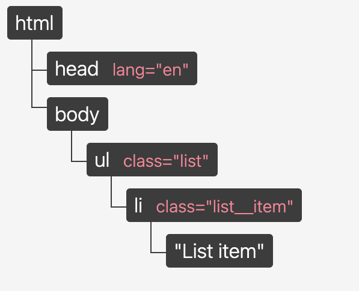

# React

## Какие основные преимущества использования React?


1. **Виртуальный DOM:** React использует виртуальный DOM для эффективного управления обновлениями интерфейса. Это позволяет минимизировать операции непосредственно с реальным DOM, что повышает производительность приложения.

2. **Компонентный подход:** React позволяет разбивать пользовательский интерфейс на множество мелких компонентов. Эти компоненты могут быть повторно использованы, что упрощает разработку, тестирование и обслуживание кода.

3. **Однонаправленный поток данных:** Реакт обеспечивает однонаправленный поток данных, что упрощает отслеживание изменений состояния и делает код более предсказуемым и легко поддерживаемым.

4. **Объявительный подход:** React использует объявительный стиль программирования, который позволяет описывать, как должен выглядеть интерфейс в зависимости от состояния. Это делает код более читаемым и понятным.

5. **Высокая производительность:** Благодаря виртуальному DOM и оптимизациям, React способен обеспечивать хорошую производительность даже при работе с большими и сложными интерфейсами.

## Что такое JSX?

JSX (JavaScript XML) - это расширение синтаксиса JavaScript, используемое в React для описания структуры пользовательского интерфейса. Этот синтаксис позволяет объединять код JavaScript и HTML-подобные элементы в одном месте, что делает создание компонентов React более интуитивным и читаемым.

JSX трансформируется в JS с помощью таких инструментов как Babel. рансформация, обычно, включает в себя следующее: замена кода внутри тегов на вызов функции createElement, которой в качестве аргументов передаются название тега (type), свойства (props) и дочерние элементы (children). Процесс трансформации JSX в JS называется транспиляцией (transilation).

## Какие основные различия между компонентами классов и функциональными компонентами в React?

В React существуют два основных способа создания компонентов: с использованием классов и с использованием функциональных компонентов. Вот основные различия между ними:

#### Компоненты классов:

1. **Синтаксис:** Компоненты классов определяются как классы, расширяющие базовый класс `React.Component`.

2. **Состояние (state):** Компоненты классов имеют встроенную поддержку для состояния (state), что позволяет им хранить и управлять данными внутри компонента.

3. **Методы жизненного цикла:** Компоненты классов обладают широким набором методов жизненного цикла (например, `componentDidMount`, `componentDidUpdate`, `componentWillUnmount`), которые позволяют реагировать на различные этапы жизни компонента.

4. **Пропсы (props):** Пропсы передаются в компоненты классов через атрибуты при использовании. Они доступны через `this.props` внутри методов компонента.

#### Функциональные компоненты:

1. **Синтаксис:** Функциональные компоненты определяются как обычные функции.

2. **Состояние (state):** Изначально функциональные компоненты не поддерживали состояние. Однако с появлением хуков (hooks) в React (начиная с React 16.8) функциональные компоненты теперь могут использовать состояние и другие возможности, которые ранее были доступны только компонентам классов.

3. **Хуки (hooks):** Функциональные компоненты могут использовать хуки, такие как `useState`, `useEffect` и другие, для управления состоянием, эффектами и другими аспектами.

4. **Пропсы (props):** Пропсы также передаются функциональным компонентам, но доступны они как аргументы функции.

В целом, с появлением хуков, функциональные компоненты стали предпочтительным выбором для большинства случаев в React, так как они обеспечивают более простой и читаемый синтаксис, а также упрощенный способ управления состоянием и эффектами.

## Что такое Virtual DOM, и как он работает?

Virtual DOM (виртуальное DOM) - это концепция, используемая в библиотеках и фреймворках, таких как React, для оптимизации обновлений реального DOM (Document Object Model) и повышения производительности веб-приложений.

Реальный DOM - это представление структуры веб-страницы в браузере в виде дерева объектов. Когда состояние приложения меняется и требуется обновление интерфейса, браузер выполняет изменения непосредственно в реальном DOM. Однако многократные и частые обновления реального DOM могут быть затратными с точки зрения производительности, особенно для больших и сложных интерфейсов.

Виртуальное DOM решает эту проблему следующим образом:

1. **Создание виртуального DOM:** При изменении состояния приложения React создает виртуальное представление DOM-структуры, которая является легковесной копией реального DOM.

2. **Сравнение виртуального DOM:** React сравнивает предыдущее состояние виртуального DOM с новым состоянием, выявляя, какие части интерфейса были изменены.

3. **Генерация разницы (патч):** На основе сравнения React создает минимальный набор изменений, необходимых для обновления виртуального DOM согласно новому состоянию.

4. **Применение изменений:** Созданные изменения применяются к реальному DOM только одним обновлением, что позволяет избежать множественных манипуляций с реальным DOM.

Использование виртуального DOM позволяет значительно улучшить производительность, так как обновления реального DOM происходят только в необходимых местах. Это также делает разработку более удобной и предсказуемой, поскольку разработчику не нужно ручным образом управлять множеством изменений на реальном DOM.


## Как React использует VDOM?

>1. React использует паттерн проектирования «Наблюдатель» (observer) и реагирует на изменения состояния**

В React каждая часть UI является компонентом и почти каждый компонент имеет состояние (state). При изменении состояния компонента, React обновляет VDOM. После обновления VDOM, React сравнивает его текущую версию с предыдущей. Этот процесс называется «поиском различий» (diffing).

>2. React использует механизм пакетного (batch) обновления RDOM

Это также положительно влияет на производительность. Названный механизм предполагает отправку обновлений в виде пакетов (набора, серии) вместо отправки отдельного обновления при каждом изменении состояния.

>3. React использует эффективный алгоритм поиска различий

React использует эвристический O(n) (линейный) алгоритм, основываясь на двух предположениях:
   - Два элемента разных типов приводят к построению разных деревьев
   - Разработчик может обеспечить стабильность элементов между рендерингами посредством пропа key (ключ)


## Как выглядит VDOM?

VDOM — это обычный JavaScript-объект.

Представим, что у нас имеется такое DOM-дерево:


Это дерево может быть представлено в виде такого объекта:
```javascript
const vdom = {

 tagName: 'html',

 children: [

   { tagName: 'head' },

   {

     tagName: 'body',

     children: [

       {

         tagName: 'ul',

         attributes: { class: 'list' },

         children: [

           {

             tagName: 'li',

             attributes: { class: 'list_item' },

             textContent: 'Элемент списка',

           }, // конец li

         ],

       }, // конец ul

     ],

   }, // конец body

 ],

} // конец html
```

Это наш VDOM. Как и RDOM, он является объектным представлением HTML-документа (разметки). Однако, поскольку он представляет собой всего лишь объект, мы можем свободно и часто им манипулировать, не прикасаясь к RDOM без крайней необходимости.
## Какие методы жизненного цикла компонентов вы знаете?

В React компоненты проходят через ряд этапов своего "жизненного цикла", включая следующие методы:

1. **constructor(props)**: Вызывается при создании компонента. Здесь происходит инициализация состояния и привязка методов.

2. **componentDidMount()**: Вызывается после того, как компонент был вставлен в DOM. Часто используется для загрузки данных с сервера.

3. **componentDidUpdate(prevProps, prevState)**: Вызывается после обновления компонента. Позволяет реагировать на изменения пропсов или состояния.

4. **shouldComponentUpdate(nextProps, nextState)**: Позволяет оптимизировать обновления компонента, возвращая `false`, если обновление не требуется.

5. **componentWillUnmount()**: Вызывается перед удалением компонента из DOM. Используется для очистки ресурсов.

6. **static getDerivedStateFromProps(props, state)**: Редко используется. Позволяет обновить состояние на основе новых пропсов.

7. **getSnapshotBeforeUpdate(prevProps, prevState)**: Редко используется. Позволяет получить информацию из DOM перед его обновлением.

8. **componentDidCatch(error, info)**: Используется для обработки ошибок в дочерних компонентах.

## Что такое "состояние" (state) компонента в React?

"Состояние" (state) в React представляет собой объект, который содержит данные, влияющие на то, как компонент отображается и ведет себя. Состояние является одним из фундаментальных понятий React и используется для хранения информации, которая может изменяться во время работы приложения.

Когда состояние компонента изменяется, React автоматически перерендерит компонент, чтобы отразить новое состояние. Состояние обычно инициализируется в методе `constructor()` компонента, и для его обновления используется метод `setState()`.


## Что такое пропсы (props) в React?

Пропсы (props) в React - это механизм передачи данных от родительского компонента к дочернему. Они представляют собой атрибуты, которые задаются при создании компонента и не могут быть изменены самим компонентом, который их получает. Пропсы используются для передачи информации о состоянии или конфигурации компонента.

## В чем разница между состоянием и пропсами в React?

>Состояние (state) и пропсы (props) - это два основных концепта в React, используемые для управления данными в компонентах. Они имеют разные цели и характеристики:

**Состояние (state):**

1. Состояние - это внутренние данные компонента, которые могут изменяться во время выполнения.
2. Определяется и управляется самим компонентом, в котором оно находится.
3. Изменение состояния вызывает перерендеринг компонента, чтобы отобразить новое состояние.
4. Доступно только для компонента, в котором было определено состояние.
5. Обновляется с использованием метода `setState()`.

**Пропсы (props):**

1. Пропсы - это данные, передаваемые от родительского компонента к дочернему компоненту.
2. Нельзя изменить пропсы внутри дочернего компонента. Они считаются "только для чтения".
3. Пропсы служат для настройки и передачи данных в компоненты.
4. Используются для связи между различными компонентами и передачи информации вниз по иерархии.
5. Не вызывают перерендеринг при их изменении.

Вкратце, состояние предназначено для хранения и управления изменяющимися данными внутри компонента, тогда как пропсы предназначены для передачи данных от родительского компонента к дочернему. Оба этих концепта помогают создавать динамичные и переиспользуемые интерфейсы в React приложениях.

## Как обрабатывать события в React?

>В React обработка событий происходит с использованием синтаксиса, аналогичного обработке событий в нативном JavaScript, но с некоторыми отличиями. Вот как обрабатывать события в React:

1. **Создание метода обработки события:**
   Создайте метод внутри компонента, который будет выполняться при возникновении события. Название метода обычно начинается с префикса "handle", за которым следует имя события или описательное имя.

2. **Привязка метода к элементу:**
   Привяжите созданный метод к элементу, который будет генерировать событие. Это делается с помощью JSX, указав метод как значение атрибута события.

3. **Использование аргументов:**
   Внутри метода обработки события вы можете получить доступ к объекту события и использовать его свойства, такие как `target`, чтобы получить информацию о событии.

## Что такое условный рендеринг в React?

>Условный рендеринг в React - это подход, при котором решается, должен ли компонент или его часть отображаться на основе какого-либо условия. Это позволяет динамически контролировать, какие элементы интерфейса будут показаны или скрыты в зависимости от состояния приложения или других факторов.

## Как передать данные между компонентами вверх по иерархии?

**Колбэки (callback функции):** Родительский компонент передает функцию в качестве пропса дочернему компоненту. Дочерний компонент может вызвать эту функцию, передавая ей данные обратно вверх по иерархии.

Пример:

```jsx
// Родительский компонент
import React, { useState } from "react";
import ChildComponent from "./ChildComponent";

const ParentComponent = () => {
  const [receivedData, setReceivedData] = useState("");

  const handleDataChange = (data) => {
    setReceivedData(data);
  };

  return (
    <div>
      <p>Полученные данные: {receivedData}</p>
      <ChildComponent onDataChange={handleDataChange} />
    </div>
  );
};

// Дочерний компонент
import React from "react";

const ChildComponent = (props) => {
  const sendDataToParent = () => {
    props.onDataChange("Данные от дочернего компонента");
  };

  return <button onClick={sendDataToParent}>Отправить данные</button>;
};

export default ChildComponent;
```

Это позволяет дочернему компоненту воздействовать на данные и состояние родительского компонента.

## Какие хуки вы знаете?

>**Хуки** – это функции-крючки, с помощью которых можно «прицепиться» к состоянию и методам жизненного цикла React из функциональных компонентов. Хуки – мощные инструменты для управления состоянием, обработки побочных эффектов и повторного использования логики:

1. useState - управления состоянием в функциональных компонента
2. useEffect - 	выполнения побочных эффектов в функциональных компонентах (например, для получения данных или подписки на события)
3. useContext - доступа к значению контекста React в функциональном компоненте
4. useRef - создания изменяемых ссылок на элементы или значения, которые сохраняются во время рендеринга
5. useCallback - мемоизации функций для предотвращения ненужных повторных рендеров
6. useMemo - запоминания значений с целью повышения производительности за счет кэширования ресурсоемких вычислений
7. useReducer - управления состоянием с помощью функции reducer, аналогично тому, как это делается в Redux
8. useLayoutEffect - 	выполнения побочных эффектов подобно useEffect, с той разницей, что эффект запускается синхронно после всех мутаций DOM

## Какой второй аргумент может быть передан в setState?

>Вторым аргументом, который может быть необязательно передан setState, является функция обратного вызова , которая вызывается сразу после завершения setState и повторной отрисовки компонентов. 


## Для чего и как используется useMemo?

Хук useMemo используется для кэширования и запоминания результатов вычислений. В него передается функция, которая производит вычисления, и массив зависимостей. Хук будет пересчитывать значение только тогда, когда изменится одна из зависимостей – эта оптимизация помогает избежать ресурсозатратных вычислений при каждом рендере.

## Для чего используется useCallback и как он работает?

Хук useCallback возвращает мемоизированную версию коллбэк-функции. Эта версия будет изменяться только в том случае, если изменятся значения зависимостей в массиве зависимостей, переданном в useCallback.

>1. Хук используют для передачи функций обратного вызова в оптимизированные дочерние компоненты, которые для предотвращения лишних отрисовок полагаются на ссылочное равенство (===).
>2. Благодаря тому, что useCallback возвращает мемоизированную версию, ссылка на коллбэк будет стабильной между рендерами, если зависимости не изменились.

Таким образом, useCallback позволяет оптимизировать производительность за счет избежания лишних отрисовок.

## Для чего используется useContext и как он работает?
Контекст предоставляет возможность обмена данными между компонентами без необходимости явной передачи реквизита через каждый уровень дерева.

Компонент, вызывающий useContext, всегда будет перерисовываться при изменении значения контекста. Если перерисовка компонента требует больших затрат, можно оптимизировать ее с помощью мемоизации.

React Context API состоит из трех основных частей:

1. createContext – используется для создания нового объекта контекста.
2. Context.Provider – используется для предоставления значения контексту. Он оборачивает компоненты, которым необходим доступ к значению.
3. Context.Consumer или хук useContext – этот компонент или хук используется для получения значения из контекста. Он может быть использован в любом компоненте, входящем в состав провайдера контекста.


## Для чего используется useRef и как он работает? 
Хук useRef возвращает ссылку (ref-объект), которая может быть привязана к текущему значению какого-либо элемента или состояния компонента. При создании этого объекта, начальное значение устанавливается равным переданному аргументу. Такой объект сохраняется между различными рендерами компонента и его значение не меняется: если мы изменим значение переданного аргумента, это не повлияет на ref-объект.

Обычно useRef используется для доступа к дочерним элементам в императивном стиле, то есть явно обращаясь к какому-то элементу DOM. Это позволяет выполнять различные действия над элементом – изменять стили, добавлять события и т.д.

## Что такое reducer в Redux и какие параметры он принимает?

Редуктор – это чистая функция, принимающая в качестве параметров состояние и действие. Внутри редуктора мы отслеживаем тип полученного действия и, в зависимости от него, модифицируем состояние и возвращаем новый объект состояния.

## Что такое пробрасывание пропсов (props drilling)?

Под пробрасыванием («сверлением») реквизитов понимается процесс передачи реквизитов через несколько уровней вложенных компонентов, даже если некоторые промежуточные компоненты не используют эти пропсы напрямую. Глубокое пробрасывание делает структуру кода сложной и запутанной.

Устранить проблему пробрасывания можно с помощью контекста или библиотек управления состоянием, таких как Redux или MobX. Эти подходы позволяют получить доступ к данным через компоненты без необходимости передавать реквизиты через каждый промежуточный компонент.

## Что такое фрагмент React?

Возврат нескольких элементов из компонента – обычная практика в React. Однако это может привести к созданию большого количества элементов в дереве виртуального DOM, отчего пострадает производительность приложения.

Фрагменты React позволяют группировать несколько элементов внутри функции-компонента, избегая таким образом создания большого количества узлов в виртуальном DOM. Это улучшает производительность приложения и читаемость кода.

## Что такое React Reconciliation?

React использует алгоритм согласования (reconciliation) для определения изменений между старым и новым деревом виртуального DOM. Этот алгоритм сравнивает каждый элемент старого дерева с соответствующим элементом нового дерева и определяет, какие элементы были добавлены, удалены или обновлены. Затем React применяет эти изменения к реальному DOM-дереву, обновляя только те элементы, которые действительно изменились.

Этот алгоритм позволяет значительно повысить производительность React-приложений, так как он не обновляет все элементы дерева при каждом изменении, а только те, которые действительно нуждаются в обновлении.

## Зачем нужны ключи в списках при использовании map()?

Ключи в списках помогают React отслеживать изменения в списке. Когда элементы в списке обновляются, удаляются или добавляются, React использует ключи для определения того, какие изменения произошли и как обновить DOM. Без ключей React не сможет эффективно обновлять список, что может привести к снижению производительности. 

## Что такое пользовательский хук?

Пользовательский хук в React – это функция, которая позволяет повторно использовать логику внутри компонентов. Хуки позволяют инкапсулировать определенную логику и использовать ее в разных компонентах. Названия пользовательских хуков обычно начинаются с use, и они могут вызывать другие хуки при необходимости.

## Перечислите правила создания пользовательского хука.

1. Название хука должно начинаться с use.
2. Следует использовать сначала встроенные хуки, если они решают нужную задачу, прежде чем создавать свои.
3. Нельзя вызывать хук условно. Хук надо вызывать тогда, когда это необходимо.
4. В хуке должна быть только логика, которую можно использовать повторно. Не стоит добавлять в него код, который нужен только в одном месте.
5. Хук должен быть чистой функцией.
6. Хук может возвращать значение или вызывать другие хуки. Это позволяет создавать цепочки обработки данных.
7. Название хука должно быть понятным и отражать его назначение. Это поможет другим разработчикам понять, что делает этот хук и как его можно использовать.

## Что такое серверный рендеринг (Server-Side Rendering)?

Серверный рендеринг (SSR) – это техника, при которой сервер создает готовую к отображению веб-страницу и отправляет ее пользователю. Этот подход отличается от традиционного, при котором сервер отправляет только исходный код HTML, а готовый вид страница приобретает после обработки клиентским браузером.

Основная цель серверного рендеринга – улучшение скорости загрузки страниц и повышение позиций в поисковом ранжировании. Используя SSR, сервер подготавливает страницу полностью, включая динамическое содержимое. В результате пользователь получает готовую к просмотру страницу, без необходимости выполнения дополнительных запросов к серверу.

Применение SSR особенно полезно для приложений, где много контента генерируется с помощью JavaScript, так как поисковые системы не могут индексировать такой контент. Используя серверный рендеринг, поисковики могут легко увидеть и проиндексировать все содержимое страницы.

Серверный рендеринг имеет несколько весомых преимуществ:

1. Улучшение времени загрузки – серверный‌ рендеринг позволяет серверу отправить пользователю полностью готовую к отображению HTML-страничку, уменьшая тем самым объем обработки на стороне клиента и ускоряя загрузку страницы.
2. Улучшение видимости в поисковых системах – поисковые роботы могут легко просматривать и индексировать содержание страниц, обработанных на стороне сервера, что приводит к улучшению видимости в результатах поиска.
3. Обеспечение доступности – серверный рендеринг обеспечивает доступность контента для пользователей с отключенным JavaScript, гарантируя надежное и полное отображение всех страниц приложения.
4. Повышение производительности в условиях низкой‌ скорости интернета –серверный рендеринг уменьшает объем данных, получаемых пользователем.
5. Несмотря на все преимущества SSR, важно отметить, что по сравнению с методами рендеринга на стороне клиента он может создавать большую нагрузку на сервер и усложнять обслуживание. Необходимо тщательно учитывать такие факторы, как кэширование, масштабируемость и оптимизация производительности рендеринга на стороне сервера.

##  Какие основные функции Next.js вы знаете?

1. getStaticProps – метод используется для получения данных во время сборки и предварительного рендеринга страницы в виде статического HTML. Он гарантирует, что данные будут доступны во время сборки и не изменятся при последующих запросах.
2. getServerSideProps – используется для получения данных при каждом запросе и предварительного рендеринга страницы на сервере. Пригодится, когда необходимо получить данные, которые могут часто меняться или являются специфическими для пользователя.
3. getStaticPaths – используется для определения списка статичных путей, которые будут доступны во время компиляции приложения. Этот метод обычно используется для генерации данных для динамических страниц с параметрами. Например, если у вас есть динамическая страница с ID пользователя в качестве параметра, вы можете использовать getStaticPaths для определения всех возможных ID пользователей, которые могут быть использованы на этой странице. Это позволяет Next.js предварительно сгенерировать все возможные страницы, что улучшает производительность приложения.

## Что такое "управляемые компоненты" (controlled components)?

"Управляемые компоненты" (controlled components) - это понятие, связанное с управлением состоянием форм и ввода данных в React. В управляемых компонентах значение элемента ввода (например, текстового поля или чекбокса) контролируется состоянием React компонента, а не DOM элементом.

Когда компонент контролирует значение ввода, он хранит это значение в своем состоянии и обновляет его с помощью обработчиков событий (например, при изменении текста в поле ввода). Это позволяет иметь полный контроль над данными формы и легко реагировать на изменения.

Пример управляемого компонента с текстовым полем:

```jsx
import React, { useState } from "react";

const ControlledComponent = () => {
  const [inputValue, setInputValue] = useState("");

  const handleInputChange = (event) => {
    setInputValue(event.target.value);
  };

  return (
    <div>
      <input type="text" value={inputValue} onChange={handleInputChange} />
      <p>Введенное значение: {inputValue}</p>
    </div>
  );
};

export default ControlledComponent;
```

В этом примере значение текстового поля `inputValue` связано со состоянием компонента. Когда значение текстового поля меняется, вызывается обработчик `handleInputChange`, который обновляет состояние и, следовательно, значение текстового поля.

Использование управляемых компонентов обеспечивает предсказуемость состояния, упрощает взаимодействие с данными и позволяет выполнять валидацию и другие операции над введенными данными перед их отправкой на сервер.

## Что такое "неуправляемые компоненты" (uncontrolled components)?

"Неуправляемые компоненты" (uncontrolled components) - это понятие, противоположное управляемым компонентам, и оно относится к управлению состоянием форм и ввода данных в React. В случае неуправляемых компонентов, значение элемента ввода (например, input или textarea) хранится непосредственно в DOM, и React компонент не управляет этим значением.

Вместо использования состояния компонента для хранения значения элемента ввода, неуправляемые компоненты обращаются к DOM напрямую для получения и обновления значения.

Пример неуправляемого компонента с текстовым полем:

```jsx
import React, { useRef } from "react";

const UncontrolledComponent = () => {
  const inputRef = useRef(null);

  const handleButtonClick = () => {
    alert("Значение в поле ввода: " + inputRef.current.value);
  };

  return (
    <div>
      <input type="text" ref={inputRef} />
      <button onClick={handleButtonClick}>Показать значение</button>
    </div>
  );
};

export default UncontrolledComponent;
```

В этом примере значение текстового поля не хранится в состоянии компонента. Вместо этого мы используем `useRef` для получения ссылки на DOM-элемент и затем получаем его значение через `inputRef.current.value`.

Неуправляемые компоненты могут быть полезны, когда у вас есть особые случаи или требования, где контроль над состоянием через React не является оптимальным подходом. Однако, в большинстве случаев, управляемые компоненты обеспечивают более предсказуемое и удобное управление данными в формах.

## Что такое "подъем состояния" (lifting state up)?

"Подъем состояния" (lifting state up) - это паттерн в React, который предполагает перемещение состояния из дочерних компонентов в родительские компоненты, чтобы разделять и управлять состоянием на более высоком уровне и передавать его через пропсы.

Этот подход особенно полезен, когда несколько компонентов должны иметь доступ к одному и тому же состоянию или когда состояние должно быть синхронизировано между разными частями приложения.

Пример с подъемом состояния:

```jsx
import React, { useState } from "react";

const TemperatureInput = ({ scale, temperature, onTemperatureChange }) => {
  return (
    <fieldset>
      <legend>Введите температуру в градусах {scale}:</legend>
      <input
        value={temperature}
        onChange={(e) => onTemperatureChange(e.target.value)}
      />
    </fieldset>
  );
};

const Calculator = () => {
  const [celsius, setCelsius] = useState("");
  const [fahrenheit, setFahrenheit] = useState("");

  const handleCelsiusChange = (value) => {
    setCelsius(value);
    setFahrenheit((value * 9) / 5 + 32);
  };

  const handleFahrenheitChange = (value) => {
    setFahrenheit(value);
    setCelsius(((value - 32) * 5) / 9);
  };

  return (
    <div>
      <TemperatureInput
        scale="C"
        temperature={celsius}
        onTemperatureChange={handleCelsiusChange}
      />
      <TemperatureInput
        scale="F"
        temperature={fahrenheit}
        onTemperatureChange={handleFahrenheitChange}
      />
    </div>
  );
};

export default Calculator;
```

В этом примере компонент `Calculator` поднимает состояние температур из `TemperatureInput` компонентов. При изменении температуры в одном из вводов, состояние поднимается в родительский компонент `Calculator`, который затем обновляет состояние для другого ввода, обеспечивая синхронизацию температур в обеих шкалах.

"Подъем состояния" помогает упростить управление данными и их синхронизацию между компонентами, особенно при работе с компонентами на разных уровнях иерархии.

## Каким образом можно оптимизировать производительность React-приложения?

Оптимизация производительности React-приложения - это важный аспект, который может существенно повлиять на пользовательский опыт. Вот некоторые способы оптимизации производительности:

1. **Используйте управляемые компоненты:** Используйте управляемые компоненты для контроля над данными в формах и вводе. Это позволит минимизировать ненужные перерисовки и облегчит обработку введенных данных.

2. **Используйте ключи (keys) правильно:** При рендеринге списков компонентов убедитесь, что у каждого элемента есть уникальный ключ. Это позволит React эффективно обновлять только измененные элементы.

3. **Ленивая загрузка (Code Splitting):** Разделяйте ваше приложение на небольшие фрагменты и используйте механизм ленивой загрузки для загрузки компонентов только тогда, когда они действительно нужны.

4. **Мемоизация:** Используйте хуки `useMemo` и `useCallback` для кэширования вычислений и избегания ненужных пересчетов при рендеринге.

5. **Пакеты компонентов (Component Libraries):** Используйте готовые пакеты компонентов (например, Material-UI, Ant Design), которые оптимизированы и протестированы с учетом производительности.

6. **Виртуализация списков:** При работе с большими списками данных используйте библиотеки виртуализации (например, `react-virtualized`), чтобы рендерить только видимые элементы списка.

7. **Оптимизация рендеринга:** Избегайте ненужных рендеров компонентов, используйте `shouldComponentUpdate` (в классовых компонентах) или `React.memo` (в функциональных компонентах) для предотвращения лишних перерисовок.

8. **Избегайте глубокой вложенности:** Постарайтесь не создавать слишком глубокую иерархию компонентов, чтобы уменьшить время рендеринга и пересчета.

9. **Анализ производительности:** Используйте инструменты, такие как React DevTools и браузерные инструменты производительности, чтобы анализировать и оптимизировать производительность вашего приложения.

10. **Серверный рендеринг (Server-Side Rendering, SSR):** Если это уместно для вашего приложения, рассмотрите возможность использования SSR для улучшения начальной загрузки и SEO.

Обратите внимание, что оптимизация производительности зависит от конкретного контекста вашего приложения. Рекомендуется использовать инструменты профилирования и измерять производительность после каждой оптимизации, чтобы убедиться, что она действительно приводит к улучшениям.

## Что такое HOC (Higher-Order Component) в React?

Высокоуровневый компонент (Higher-Order Component, HOC) - это паттерн в React, который позволяет повторно использовать логику компонентов, абстрагируя ее от самих компонентов. HOC не является частью API React, это скорее паттерн композиции компонентов.

HOC - это функция, которая принимает компонент и возвращает новый компонент с дополнительной логикой. HOC позволяют вынести общие функциональные или структурные аспекты компонентов и повторно использовать их с разными компонентами.

Пример HOC:

```jsx
import React from "react";

const withLogger = (WrappedComponent) => {
  return class WithLogger extends React.Component {
    componentDidMount() {
      console.log("Компонент был отрисован");
    }

    render() {
      return <WrappedComponent {...this.props} />;
    }
  };
};

const MyComponent = () => {
  return <div>Содержимое компонента</div>;
};

const EnhancedComponent = withLogger(MyComponent);

export default EnhancedComponent;
```

В этом примере `withLogger` - это HOC, который добавляет логирование в метод `componentDidMount`. Затем компонент `MyComponent` обертывается HOC, создавая `EnhancedComponent`.

## Что такое порталы (portals) в React?

Порталы (portals) - это механизм в React, который позволяет рендерить дочерние элементы в DOM-узлы, которые находятся вне иерархии DOM-компонента. Это означает, что вы можете рендерить содержимое компонента в другой элемент вне текущего дерева компонентов.

Порталы полезны, когда вам нужно рендерить компоненты на верхнем уровне DOM (например, для создания модальных окон или всплывающих подсказок), но сохранить логику и состояние компонента внутри вашего React-приложения.

Пример использования порталов:

```jsx
import React from "react";
import ReactDOM from "react-dom";

const Modal = ({ children }) => {
  const modalRoot = document.getElementById("modal-root");
  return ReactDOM.createPortal(children, modalRoot);
};

const App = () => {
  return (
    <div>
      <p>Содержимое основного компонента</p>
      <Modal>
        <p>Содержимое модального окна</p>
      </Modal>
    </div>
  );
};

ReactDOM.render(<App />, document.getElementById("root"));
```

В этом примере компонент `Modal` использует порталы для рендеринга своего содержимого в DOM-узле с id `modal-root`. По сути, `Modal` создает "всплывающее" окно, которое рендерится на уровне верхнего уровня, но все еще имеет доступ к состоянию и методам компонента `App`.

Важно отметить, что порталы не изменяют иерархию компонентов в React-приложении, они просто рендерят содержимое в другом месте в DOM.

## Как реализовать lazy loading в React с использованием Suspense?

Ленивая загрузка (lazy loading) в React позволяет откладывать загрузку компонентов до тех пор, пока они действительно не понадобятся. Это может улучшить производительность приложения, уменьшив начальное время загрузки.

Для реализации ленивой загрузки с использованием `Suspense`, вы можете использовать функцию `React.lazy()`, которая позволяет лениво загружать динамические импорты компонентов. Однако, `React.lazy()` работает только с дефолтными экспортами компонентов.

Вот как это можно сделать:

1. Создайте лениво загружаемый компонент:

```jsx
// LazyComponent.js
import React from "react";

const LazyComponent = () => {
  return <div>Лениво загруженный компонент</div>;
};

export default LazyComponent;
```

2. Используйте `React.lazy()` для ленивой загрузки:

```jsx
import React, { Suspense } from "react";

const LazyComponent = React.lazy(() => import("./LazyComponent"));

const App = () => {
  return (
    <div>
      <p>Содержимое основного компонента</p>
      <Suspense fallback={<div>Загрузка...</div>}>
        <LazyComponent />
      </Suspense>
    </div>
  );
};

export default App;
```

В этом примере `React.lazy()` используется для ленивой загрузки компонента `LazyComponent`. Оборачивание `<LazyComponent />` в `<Suspense>` позволяет указать компонент-заглушку, который будет показан во время загрузки.

При использовании ленивой загрузки через `React.lazy()`, не забудьте, что это работает только с дефолтными экспортами компонентов. Если вы хотите лениво загрузить компоненты с именованными экспортами, вы можете использовать альтернативный подход с `import()`:

## Какие нововведения были добавлены в React 16?

React 16, также известный как React Fiber, внес множество значительных изменений и нововведений:

1. **Fiber Architecture**: Была введена новая архитектура под названием Fiber, которая позволила React более эффективно обрабатывать обновления компонентов, делая приложения более отзывчивыми.

2. **Portals**: Была добавлена возможность использовать Portals, позволяющие рендерить дочерние компоненты за пределами иерархии DOM-узлов родительского компонента. Это полезно, например, для создания модальных окон или всплывающих меню.

3. **Error Boundaries**: Введены Error Boundaries, которые позволяют изолировать ошибки в компонентах, предотвращая падение всего приложения. Это помогает улучшить стабильность интерфейса.

4. **Fragment**: Появился новый компонент Fragment, который позволяет группировать дочерние элементы без добавления лишних DOM-узлов.

5. **Сustom DOM Attributes**: Теперь можно передавать пользовательские атрибуты в DOM-элементы без предупреждений.

6. **Server-Side Rendering Improvements**: Улучшения в механизмах SSR (Server-Side Rendering) с помощью новых API и оптимизаций.

7. **Return Types**: Введены новые типы возвращаемых значений для компонентов, такие как `string` и `number`, что позволяет использовать элементы возвращаемые функциональными компонентами в качестве дочерних элементов.

8. **Поддержка Map и Set**: React Elements теперь могут быть созданы из экземпляров Map и Set.

9. **Более компактный React**: Размер библиотеки был уменьшен за счет оптимизаций и удаления устаревшего кода.

10. **Новые Warnings и Deprecations**: Были внесены изменения в систему предупреждений, а также удалены устаревшие методы.

11. **Новый рендерер**: Добавлен новый экспериментальный рендерер под названием Scheduler, который позволяет контролировать приоритеты рендеринга для лучшей отзывчивости интерфейса.

12. **Событийный обработчик onFocus**: Введена поддержка обработчика `onFocus` для обработки фокусировки на элементах.

13. **Новый атрибут forwardRef**: Добавлен атрибут `forwardRef`, упрощающий передачу ref'ов между компонентами.


## Каким образом можно оптимизировать рендеринг компонентов в React?

Оптимизация рендеринга компонентов в React помогает улучшить производительность вашего приложения и обеспечить более плавный пользовательский опыт. Вот несколько способов, как можно оптимизировать рендеринг компонентов:

1. **Использование ключей (Keys)**:

   - При отображении списков элементов в React, уделяйте внимание уникальным ключам (`key`).
   - Ключи помогают React определить, какие элементы были добавлены, изменены или удалены, что помогает сократить количество изменений в DOM.

2. **Избегание ненужных рендеров**:

   - Используйте методы `shouldComponentUpdate` (в классовых компонентах) или `React.memo` (в функциональных компонентах) для предотвращения ненужных перерисовок.
   - Они позволяют проверить, действительно ли компонент нужно обновлять при изменении состояния или пропсов.

3. **Использование PureComponent и memo**:

   - Воспользуйтесь `PureComponent` (в классовых компонентах) или `React.memo` (в функциональных компонентах) для автоматической проверки изменений пропсов и состояния перед обновлением компонента.

4. **Разделение компонентов**:

   - Разбейте большие компоненты на более мелкие, чтобы уменьшить область обновления и сделать код более модульным.

5. **Использование хуков**:

   - Хуки, такие как `useMemo` и `useCallback`, позволяют кэшировать значения и колбэки, что уменьшает избыточные вычисления и обновления.

6. **Ленивая загрузка (Lazy Loading)**:

   - Используйте ленивую загрузку для отдельных компонентов с помощью `React.lazy` и `Suspense`, чтобы загружать компоненты только тогда, когда они действительно понадобятся.

7. **Оптимизированные список**:

   - Для отображения больших списков используйте библиотеки, такие как `react-virtualized` или `react-window`, чтобы рендерить только видимые элементы.

8. **Пакетное обновление (Batching)**:

   - React автоматически группирует несколько обновлений состояния или пропсов в одну операцию, чтобы уменьшить количество изменений в DOM.

9. **Использование Production Build**:

   - При развертывании приложения используйте оптимизированный "production" билд React, который включает минимизированный код и другие оптимизации.

10. **Профилирование**:
   - Используйте инструменты профилирования React, такие как React DevTools Profiler, чтобы выявить узкие места в производительности и оптимизировать их.

Оптимизация рендеринга компонентов – это постоянный процесс, так как производительность может зависеть от конкретного приложения и его контекста. Регулярное изучение новых инструментов и методов поможет улучшить производительность вашего React-приложения.

### Что такое "глубокое сравнение" (deep comparison) в контексте оптимизации производительности React?

"Глубокое сравнение" (deep comparison) - это процесс сравнения двух объектов или структур данных на основе их внутренних значений, а не на основе ссылок или идентификаторов. В контексте оптимизации производительности React, глубокое сравнение используется для определения, изменились ли данные в компонентах, и стоит ли перерисовывать компонент из-за этих изменений.

При работе с React, компоненты могут перерисовываться при изменении состояния или пропсов. Однако, если компонент перерисовывается слишком часто, это может негативно сказаться на производительности, так как каждое обновление компонента требует выполнения ряда операций, включая генерацию виртуального DOM и обновление реального DOM.

Чтобы избежать избыточных перерисовок, React использует механизмы оптимизации, такие как "поверхностное сравнение" (shallow comparison) и "глубокое сравнение" (deep comparison).

- **Поверхностное сравнение (Shallow Comparison)**:

   - При поверхностном сравнении React сравнивает значения пропсов и состояния компонентов. Если значения не изменились, React предполагает, что компонент можно не перерисовывать.

- **Глубокое сравнение (Deep Comparison)**:
   - Глубокое сравнение используется, когда данные представляют собой сложные структуры, например, вложенные объекты или массивы. В этом случае React проверяет не только ссылки на объекты, но и их содержимое.
   - Если какие-либо вложенные данные изменились, компонент будет перерисован.

Однако глубокое сравнение может быть ресурсоемким, особенно для больших структур данных. Поэтому, в определенных случаях, полезно использовать методы оптимизации, такие как `React.memo` (в функциональных компонентах) или `shouldComponentUpdate` (в классовых компонентах), чтобы управлять поведением перерисовок на основе глубокого сравнения.

## Какие паттерны использования Redux вы знаете?

Redux - это популярная библиотека для управления состоянием приложения в JavaScript. Она предлагает ряд паттернов использования, которые помогают организовать код и облегчить разработку. Вот некоторые из них:

1. **Action-Creator Pattern**: Этот паттерн заключается в создании функций-создателей действий (action creators), которые возвращают объекты с информацией о событии или запросе к изменению состояния. Например, `const increment = (amount) => { return { type: 'INCREMENT', payload: amount }; }`. Это помогает стандартизировать создание действий и сделать их более удобными для использования.

2. **Reducer Pattern**: В Redux редьюсеры (reducers) используются для определения, как изменяется состояние приложения при получении действий. Редьюсер - это чистая функция, которая принимает текущее состояние и действие, и возвращает новое состояние. Паттерн предлагает разделить изменение состояния на небольшие функции, каждая из которых ответственна за изменение своей части состояния.

3. **Store Pattern**: Центральным пунктом в Redux является хранилище (store), которое содержит всё состояние приложения. Хранилище позволяет получать текущее состояние, обновлять его с помощью действий и подписываться на изменения состояния для обновления пользовательского интерфейса.

4. **Middleware Pattern**: Redux предоставляет возможность использовать middleware - промежуточные слои для обработки действий перед их достижением до редьюсеров. Это позволяет выполнить дополнительные действия, такие как логирование, обработка асинхронных запросов или изменение действий перед их обработкой. Примерами middleware в Redux являются redux-thunk и redux-saga.

5. **Container and Presentational Components Pattern**: Данный паттерн предлагает разделить компоненты на две категории: контейнерные компоненты (container components), которые отвечают за подключение к хранилищу и передачу данных в презентационные компоненты (presentational components), которые занимаются только визуализацией и обратной связью с пользователем. Это улучшает читаемость, переиспользуемость и тестируемость компонентов.

Это только некоторые паттерны, которые можно использовать с Redux. Каждый из них имеет свои преимущества и может быть применен в зависимости от требований и сложности вашего приложения.

## Что такое "рендер-пропсы" (render props) и как они используются?

"Рендер-пропсы" (render props) - это паттерн в React, который позволяет передавать компоненту функцию через пропсы, которая затем используется для определения, что компонент должен отрисовать. Это позволяет создавать компоненты с более гибкой и многократно используемой логикой.

Принцип работы рендер-пропсов:

1. Вы создаете компонент, который принимает функцию в качестве пропса.
2. Внутри этого компонента вы вызываете переданную функцию, передавая ей необходимые данные или состояние.
3. Функция, переданная через пропсы, решает, что именно рендерить и возвращает JSX для отображения.

Пример использования рендер-пропсов:

```jsx
import React from 'react';

class MouseTracker extends React.Component {
  constructor(props) {
    super(props);
    this.state = { x: 0, y: 0 };
  }

  handleMouseMove = (event) => {
    this.setState({ x: event.clientX, y: event.clientY });
  };

  render() {
    return (
      <div onMouseMove={this.handleMouseMove}>
        {/* Рендер-пропс используется здесь */}
        {this.props.render(this.state)}
      </div>
    );
  }
}

// Использование компонента с рендер-пропсом
const App = () => (
  <div>
    <h1>Mouse Position Tracker</h1>
    <MouseTracker render={mouse => (
      <p>Mouse position: {mouse.x}, {mouse.y}</p>
    )} />
  </div>
);

export default App;
```

В этом примере `MouseTracker` принимает функцию через пропс `render`, которая определяет, что именно должно быть отрисовано внутри компонента `MouseTracker`.

Паттерн рендер-пропсов обеспечивает большую гибкость, так как позволяет переиспользовать логику компонента для различных сценариев. Он часто используется для создания библиотечных компонентов, которые предоставляют различные возможности, но оставляют гибкость в руках пользователей компонентов.

## Каким образом можно оптимизировать производительность React-приложения?

Оптимизация производительности React-приложения - это важный аспект, который может существенно повлиять на пользовательский опыт. Вот некоторые способы оптимизации производительности:

1. **Используйте управляемые компоненты:** Используйте управляемые компоненты для контроля над данными в формах и вводе. Это позволит минимизировать ненужные перерисовки и облегчит обработку введенных данных.

2. **Используйте ключи (keys) правильно:** При рендеринге списков компонентов убедитесь, что у каждого элемента есть уникальный ключ. Это позволит React эффективно обновлять только измененные элементы.

3. **Ленивая загрузка (Code Splitting):** Разделяйте ваше приложение на небольшие фрагменты и используйте механизм ленивой загрузки для загрузки компонентов только тогда, когда они действительно нужны.

4. **Мемоизация:** Используйте хуки `useMemo` и `useCallback` для кэширования вычислений и избегания ненужных пересчетов при рендеринге.

5. **Пакеты компонентов (Component Libraries):** Используйте готовые пакеты компонентов (например, Material-UI, Ant Design), которые оптимизированы и протестированы с учетом производительности.

6. **Виртуализация списков:** При работе с большими списками данных используйте библиотеки виртуализации (например, `react-virtualized`), чтобы рендерить только видимые элементы списка.

7. **Оптимизация рендеринга:** Избегайте ненужных рендеров компонентов, используйте `shouldComponentUpdate` (в классовых компонентах) или `React.memo` (в функциональных компонентах) для предотвращения лишних перерисовок.

8. **Избегайте глубокой вложенности:** Постарайтесь не создавать слишком глубокую иерархию компонентов, чтобы уменьшить время рендеринга и пересчета.

9. **Анализ производительности:** Используйте инструменты, такие как React DevTools и браузерные инструменты производительности, чтобы анализировать и оптимизировать производительность вашего приложения.

10. **Серверный рендеринг (Server-Side Rendering, SSR):** Если это уместно для вашего приложения, рассмотрите возможность использования SSR для улучшения начальной загрузки и SEO.

Обратите внимание, что оптимизация производительности зависит от конкретного контекста вашего приложения. Рекомендуется использовать инструменты профилирования и измерять производительность после каждой оптимизации, чтобы убедиться, что она действительно приводит к улучшениям.

## Что такое PropTypes?

**PropTypes** в React — это механизм, который используется для проверки типов свойств (props), передаваемых в компоненты React. Он позволяет определять, какие типы данных ожидаются, и помогает выявлять ошибки в коде на ранних этапах разработки.

```javascript
import React from 'react';
import PropTypes from 'prop-types';

const MyComponent = ({ name, age, items }) => {
   return (
           <div>
              <h1>{name}</h1>
              <p>Age: {age}</p>
              <ul>
                 {items.map((item, index) => (
                         <li key={index}>{item}</li>
                 ))}
              </ul>
           </div>
   );
};

MyComponent.propTypes = {
   name: PropTypes.string.isRequired,
   age: PropTypes.number.isRequired,
   items: PropTypes.arrayOf(PropTypes.string).isRequired,
};

export default MyComponent;
```

## Что такое Batching(Пакетирование)? 

Batching — это процесс, при котором React группирует несколько обновлений состояния в один повторный рендеринг для повышения производительности.

Например, если у вас есть два обновления состояния внутри одного и того же события щелчка, React всегда объединяет их в один повторный рендер. Если вы запустите следующий код, вы увидите, что каждый раз, когда вы щелкаете, React выполняет только один рендер, хотя вы устанавливаете состояние дважды:

```javascript
function App() {
  const [count, setCount] = useState(0);
  const [flag, setFlag] = useState(false);

  function handleClick() {
    setCount(c => c + 1); // Does not re-render yet
    setFlag(f => !f); // Does not re-render yet
    // React will only re-render once at the end (that's batching!)
  }

  return (
    <div>
      <button onClick={handleClick}>Next</button>
      <h1 style={{ color: flag ? "blue" : "black" }}>{count}</h1>
    </div>
  );
}
```

Это отлично подходит для производительности, поскольку позволяет избежать ненужных повторных рендеров. Это также предотвращает рендеринг компонентом «полузаконченных» состояний, когда была обновлена только одна переменная состояния, что может привести к ошибкам. Это может напомнить вам, как официант в ресторане не бежит на кухню, когда вы выбираете первое блюдо, а ждет, пока вы закончите свой заказ.

Обычно пакетирование безопасно, но некоторый код может зависеть от чтения чего-либо из DOM сразу после изменения состояния. Для таких случаев использования вы можете использовать , **ReactDOM.flushSync()** чтобы отказаться от пакетирования: